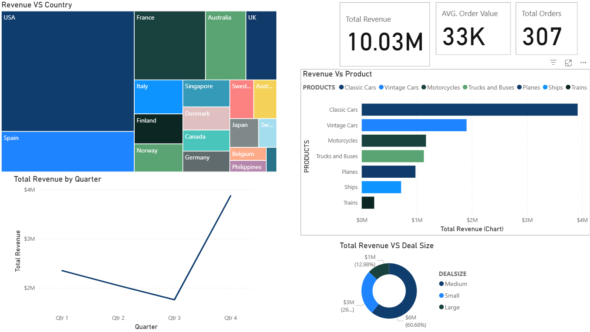

# 📊 Sales Performance Dashboard | Power BI

## 📌 Overview

An interactive Power BI dashboard built to analyze sales performance across countries, products, quarters, and deal sizes.
The dashboard helps identify revenue trends, high-performing product categories, and order patterns to support better business decisions.

This project showcases my skills in **data cleaning, exploratory data analysis, dashboard development, and business insight generation**.

## 🛠 Tech Stack

- **Python (Pandas)** – Data cleaning and preprocessing  
- **MySQL** – Data querying and validation of sales-related records  
- **Power BI Desktop** – Dashboard development and interactive reporting  
- **Power Query** – Data transformation and shaping inside Power BI  
- **DAX** – Calculated measures, KPIs, and business logic  
- **Data Visualization** – KPI cards, treemap, bar chart, line chart, and donut chart  

## 📂 Data Source

This project uses a publicly available **Sales Transactions dataset** sourced from **Kaggle**.

The dataset includes:

- Order details (Order Number, Order Date, Quantity)
- Sales metrics (Sales, Price Each)
- Product information (Product Line)
- Customer information (Customer Name)
- Geography (Country)
- Deal segmentation (Deal Size)

The dataset was cleaned and prepared using **Python** and further transformed in **Power BI / Power Query** before building the dashboard to analyze sales trends, product performance, and regional revenue contribution.

## 📈 Features & Goals

### Business Problem

Raw sales data can be difficult to interpret quickly, especially when comparing performance across different countries, products, and time periods.

### Goal of the Dashboard

To create a simple and interactive dashboard that:

* Tracks overall sales performance using key KPIs
* Compares revenue contribution by country
* Highlights best-performing product lines
* Shows quarterly revenue trends
* Analyzes revenue distribution by deal size

## 📊 Dashboard Highlights

* **KPI Cards** – Total Revenue, Average Order Value, and Total Orders
* **Revenue by Country (Treemap)** – Shows top contributing countries
* **Revenue by Product (Bar Chart)** – Compares product category performance
* **Total Revenue by Quarter (Line Chart)** – Tracks sales trend across quarters
* **Revenue by Deal Size (Donut Chart)** – Displays contribution from small, medium, and large deals

## 💡 Key Insights

* The **USA** contributes the highest share of revenue among all countries.
* **Classic Cars** generate the highest revenue among product categories.
* Revenue shows a strong jump in **Q4**, indicating peak sales performance.
* **Medium-sized deals** contribute the largest share of total revenue.

## ✅ Skills Demonstrated

* Data cleaning and transformation
* Exploratory Data Analysis (EDA)
* KPI development and dashboard design
* Business insight generation
* Presenting data in a clear and decision-focused format

## 🎯 Business Impact

This dashboard can help stakeholders:

* Monitor sales performance efficiently
* Identify top markets and products
* Understand seasonal sales trends
* Support data-driven business decisions

## 📊 Dashboard Preview

